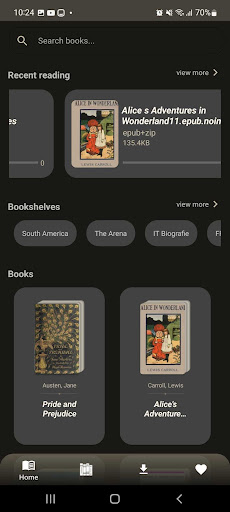

# Gutenberg-Books

## Introduction
An Andnroid app that let you find, download and read book and customize read-book theme(dark, vintage, light, fontsize,...).
The app is built without using any 3th-party library

### Feature

### Screenshots
| Home | Book details | Download Screen |
| :-------------: |:-------------:| :-----:|
| |  

| Read book | Reading progress | Lost internet |
| :-------------: |:-------------:| :-----:|
| |  
## Technologies, Libraries
### Libraries
* Executors
* SQLite, ContentProvider
* MVP
* Custom webview
* SAX parser
* ZipFile

### Workflow

### Techniques

1. How to parse XML file
* The app need to parse these xml files to get metadata
Use SAX parser to catch tags to read metadata
* SAX vs DOM
	* DOM: load the entire DOM tree into memory. Can 
travel through DOM tree.
	* SAX: Event-based XML processing, read XML file in stream, small part.
Don’t have to load and hold the whole data in memory. Thus it is lightweight.
Get data by listening for events when SAX hits XML tags.

* When to use SAX
 	* When documents are large
With SAX, memory consumption does not increase with the size of file.
40Mb doc occupy 200Mb in memory using SAX but 3Gb  with DOM
	* Need to abort parsing
Can abort processing at anytime
Only need to fetch a small part of doc, not the whole

2. How to display epub content
* Book content in Epub is HTML or XHTML
* Can use WebView to display them
* But WebView supports vertical scrolling in default
* Need to customize a WebView that support page-liked swiping. Also need to support customizing font size, text color, background color  
=> We inject JS function and CSS to support the requirements above
